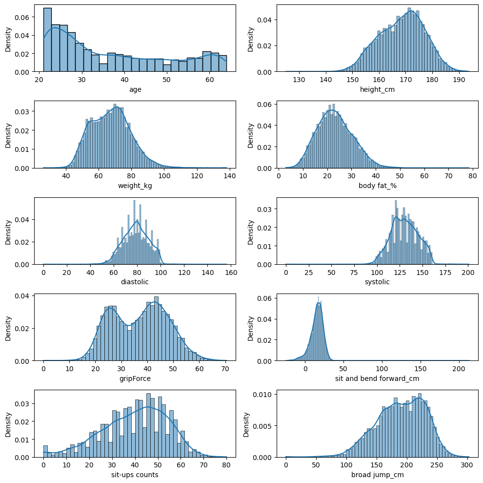
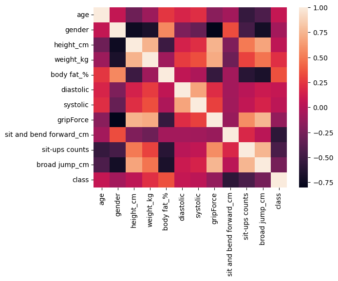
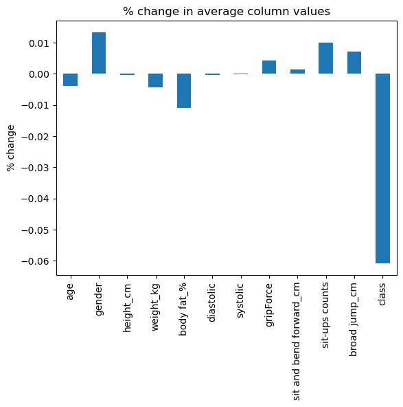

# Body_fitness_classification
This project is the practice of machine learning. We use statistic as well as machine learning to help us classify a person's body fitness whereas the data we use is contaminated. Thus, we need to do some pre-process in advance. In addition, we use logistic, knn, decision tree and random forest as the base line. Finally, to improve the model performance we use xgboost which gets training accuracy up to 96%, the testing accuracy is 75%, which indicate over-fitting, though. We think that it is the data unbalance and the wrong information that brings us to the result.

# Data source
This data is downloaded from kaggle and it is actually derived from the Korea Sports promotion foundation

<https://www.kaggle.com/datasets/kukuroo3/body-performance-data/data>

data :

age : 20 ~64.  
gender : F,M.  
height_cm : (If you want to convert to feet, divide by 30.48).   
weight_kg.  
body fat_%.  
diastolic : diastolic blood pressure (min).  
systolic : systolic blood pressure (min).  
gripForce.  
sit and bend forward_cm.  
sit-ups counts.  
broad jump_cm.  
class : A,B,C,D ( A: best) / stratified.  

# Result
## description
### Result 1
you can see the data distribution in the figure. It tells us that the data actually has some unreasonable numerical value and need to remove. In my project, I had test some remove methods, including remove unreasonable value, impute None with zero or mean. To see more detail information, check the code and final_project.

###　Result 2
you can see the relationship between each data, which help us select the useful data for training. The reason that we need to do feature extraction is because it help fasten the training time, find data that is highly-correlated and prevent over-fitting.

### Result3
it's always worth checking the data remove percentage after data cleaning. It has a lot to do with the statistic principle.

## Result image

